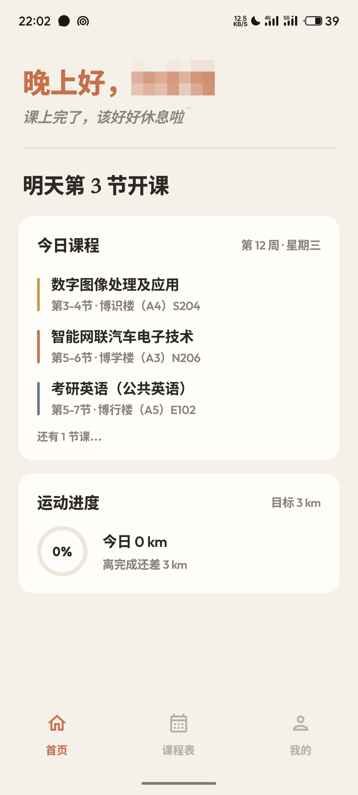
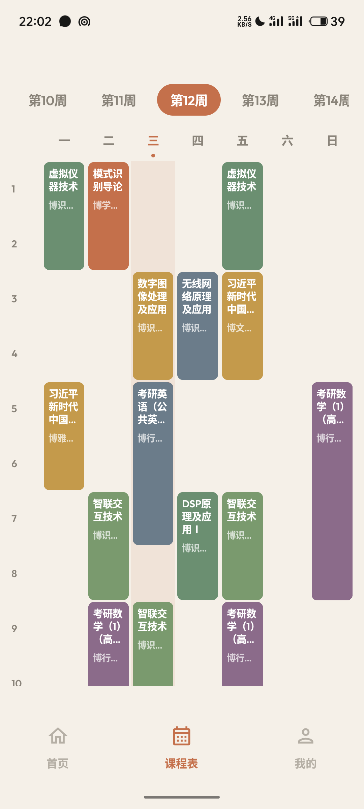
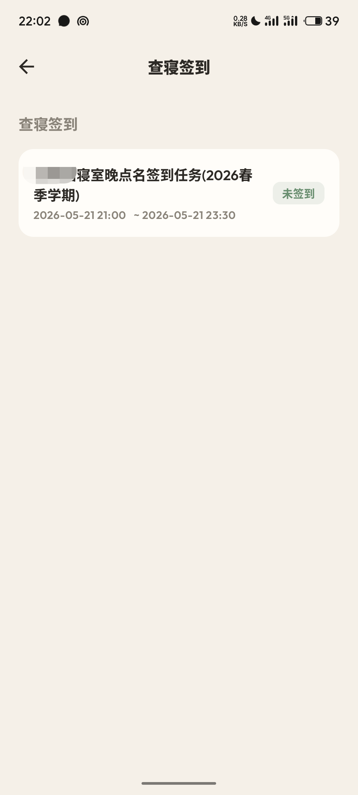
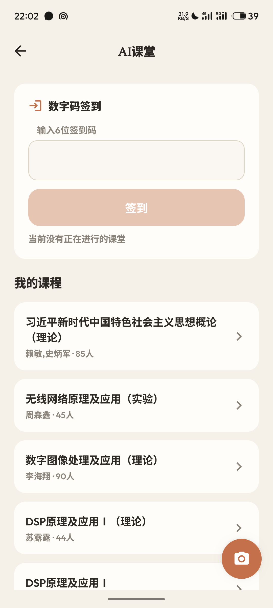
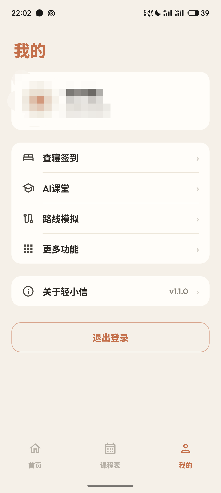
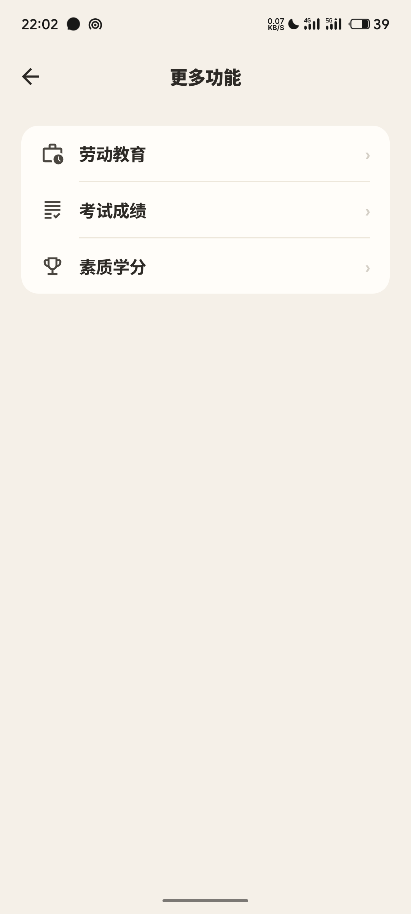
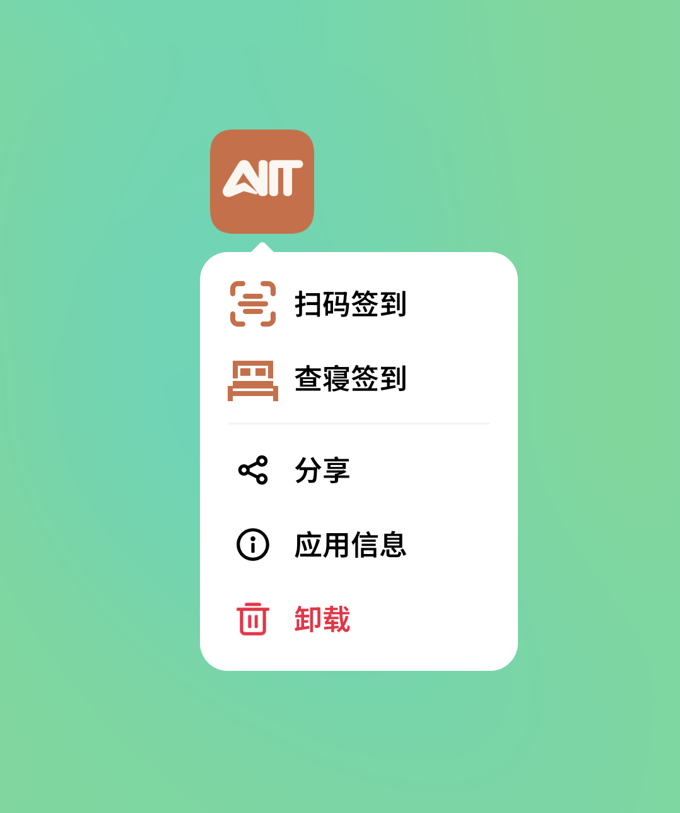

# 轻小信

 -blue)

每天看个课表都要点三四次，等进度条慢慢走完；想签到、看成绩，总得翻上好几页再点进去，又是一轮加载。用安小信的你，有过这样的烦恼吧？轻小信去繁就简，基于安小信重新设计，保留核心功能，功能一目了然，没有 WebView，没有加载等待，点了就有，滑了就跟。


## 功能

覆盖安小信绝大部分常用功能：课程表、查寝签到、节假日登记、跑步、劳动教育、AI 课堂、考试成绩、素质学分。


## 截图

|  |  |  |
|:--:|:--:|:--:|
| 首页 | 课表 | 查寝签到 |

|  |  |  |
|:--:|:--:|:--:|
| AI 课堂 | 我的 | 更多功能 |

|  | | |
|:--:|:--:|:--:|
| shortcut快捷入口 | | |


## 安装

### 方式一：下载 APK

> 请前往 [GitHub Releases](https://github.com/Relianttt/lightxin/releases) 下载最新的 APK 手动安装。

### 方式二：源码编译

```bash
git clone https://github.com/lightxin/lightxin.git
cd lightxin
./gradlew assembleDebug
```

需要 **Android Studio** 和 **JDK 17**，最低支持 **Android 8.0**。


## 贡献

欢迎提交 Issue 和 Pull Request。


## 协议

本项目基于 [MIT License](LICENSE) 开源。


## 免责声明

本项目仅供学习交流使用。使用者须遵守相关法律法规，不得将本项目用于任何非法用途。因使用本项目产生的任何法律风险与责任，均由使用者自行承担。
