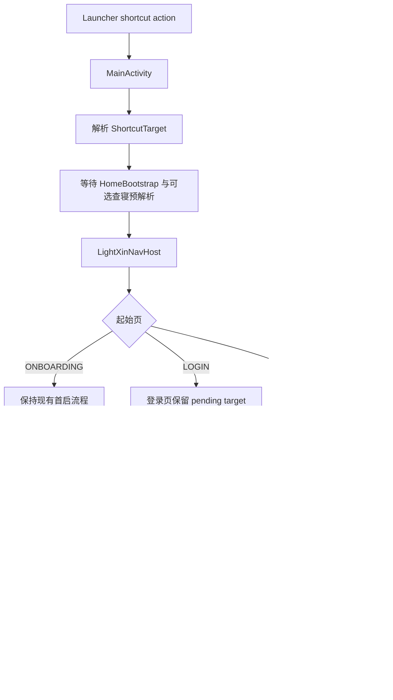

# App Shortcut 快速签到 + 扫码反馈设计

## 0. 术语约定

| 术语 | 定义 | 防冲突结论 |
|---|---|---|
| `App Shortcut` | Android 桌面长按应用图标出现的静态快捷方式，入口由 launcher 发送到 `MainActivity` 的 action 承载 | grep 未发现既有 shortcut 实现 |
| `ShortcutTarget` | App 内部对 shortcut 目标的枚举表达，当前只包含扫码签到与查寝签到 | grep 未发现同名类型 |
| `ShortcutRouter` | 负责把 shortcut 目标解析为 App 内部导航所需的最小数据；查寝目标需要解析第一个未签到 `taskDateId` | grep 未发现同名类型 |
| `扫码签到 shortcut` | 从桌面快捷方式进入 AI 课堂扫码页，返回栈保留 AI 课堂首页 | 复用 AI 课堂已有“扫码签到”术语 |
| `查寝签到 shortcut` | 从桌面快捷方式进入第一个未签到查寝任务详情；没有待签任务时落到查寝列表并提示 | 复用查寝模块已有“查寝签到”术语 |
| `扫码结果 BottomSheet` | `AiClassUiState.signResult` 有值时弹出的签到结果反馈 Sheet，替代当前 Snackbar | `ModalBottomSheet` 已在课表与节假日模块使用，无新 UI 范式 |

## 1. 决策与约束

### 需求摘要

**做什么**：用户长按桌面图标时看到“扫码签到”和“查寝签到”两个快捷方式；点击后 App 根据登录态进入对应签到流程。AI 课堂扫码签到返回首页后，用 BottomSheet 展示签到结果，避免 Snackbar 被忽略。

**为谁做**：需要高频完成课堂扫码签到或晚间查寝签到的学生。

**成功标准**：
- 安装后桌面长按图标可见两个快捷方式，且“扫码签到”排在 shortcut 列表第一位。
- 已登录点击“扫码签到”直达扫码框，扫码后返回 AI 课堂首页并弹出结果 BottomSheet。
- 已登录点击“查寝签到”优先进入第一个未签到任务详情；没有待签任务时进入查寝列表并提示。
- 未登录点击任一 shortcut 先进入登录页，登录成功后继续跳转到原 shortcut 目标。
- App 热启动时点击 shortcut 也能按新目标重新导航。

**明确不做什么**：
- 不做动态 shortcut 排序、禁用或按登录态隐藏；本次只做静态 shortcut。
- 不新增外部可分享 deep link URI；只处理 launcher shortcut action。
- 不改 AI 课堂扫码识别、FIF SSO、qrcodeHandler 302 解析、查寝详情提交逻辑。
- 不把查寝 shortcut 扩展成多任务选择；只取第一页第一个未签到任务。
- 不改首页 Home tab 的视觉和现有底部导航结构。

### 复杂度档位

走默认 Android App 内部功能档位：单 App、单 Activity、现有 Compose Navigation、现有 Hilt/Repository；没有对外 SDK、高并发、持久化 schema 或跨进程协议变更。

### 放置位置

- Shortcut action 的入口属于 `MainActivity`，因为 launcher intent 只交给 Activity。
- Shortcut 目标与导航编排属于 `navigation/`，因为它横跨登录、首页、AI 课堂、查寝多个路由，不能塞进单个 feature 包。
- 查寝目标的数据解析复用 `CheckinRepository.getTasks(page=1)`，不新增接口。
- 扫码结果反馈留在 `feature/aiclass/ui`，因为状态来源已经是 `AiClassViewModel.signResult`。

## 2. 现状与变化

### 2.1 名词层

**现状**

- `MainActivity` 只安装 splash、触发 `HomeBootstrap.load()`、设置系统栏和 `LightXinTheme`，最后调用 `LightXinNavHost(sessionManager = sessionManager)`。来源：`app/src/main/java/com/lightxin/MainActivity.kt:28-65`。
- `LightXinNavHost` 只接收 `SessionManager` 与可选 `NavHostController`，由 `isOnboarded + isLoggedIn` 决定 `ONBOARDING / LOGIN / HOME` 三个起始页。来源：`app/src/main/java/com/lightxin/navigation/NavGraph.kt:55-75`。
- `Routes` 已有 `CHECKIN_LIST / CHECKIN_DETAIL / AICLASS_HOME / AICLASS_SCAN`，但没有 shortcut 或 deep link 目标。来源：`app/src/main/java/com/lightxin/navigation/Routes.kt:6-44`。
- `CheckinRepository.getTasks(page, pageSize)` 返回 `List<CheckinTask>`，`CheckinTask.isSigned` 表示是否已签到，`taskDateId` 是进入详情页所需参数。来源：`app/src/main/java/com/lightxin/feature/checkin/data/CheckinRepository.kt:26-55`。
- `AiClassUiState.signResult` 是字符串结果，当前由 `AiClassHomeScreen` 监听后通过 Snackbar 展示并立即消费。来源：`app/src/main/java/com/lightxin/feature/aiclass/ui/AiClassViewModel.kt:21-33` / `app/src/main/java/com/lightxin/feature/aiclass/ui/AiClassHomeScreen.kt:70-75`。

**变化**

- 新增 `ShortcutTarget` 作为内部目标枚举：`SCAN_CHECKIN` 表示 AI 课堂扫码签到，`DORM_CHECKIN` 表示查寝签到。
  - 示例：launcher action `com.lightxin.action.SCAN_CHECKIN` → `ShortcutTarget.SCAN_CHECKIN`。
  - 示例：launcher action `com.lightxin.action.DORM_CHECKIN` → `ShortcutTarget.DORM_CHECKIN`。
- 新增 `ShortcutRouter` 保存查寝 shortcut 预解析结果：当目标是查寝签到时解析 `getTasks(page=1)` 的第一个 `!isSigned` 任务，输出 `taskDateId?`。
  - 示例：`[taskA(isSigned=true), taskB(isSigned=false)]` → `taskB.taskDateId`。
  - 示例：`[]` 或全部已签 → `null`，导航到查寝列表并提示“当前没有待签到的查寝任务”。
- `LightXinNavHost` 新增 shortcut 输入和消费回调，保持目标未消费即可跨登录页恢复。
  - 示例：未登录启动 `SCAN_CHECKIN` → startRoute 为 `LOGIN` 时不消费 → 登录成功导航 HOME → 执行扫码 shortcut。
- `AiClassHomeScreen` 将 `signResult` 的展示契约从 Snackbar 改为 `ModalBottomSheet`：用户关闭或点确认后再调用 `consumeSignResult()`。
  - 示例：`signResult = "签到成功"` → 弹出结果 Sheet → 点击确认 → `signResult = null`。

### 2.2 编排层

**现状**

- 冷启动 splash 放行只等待 `homeBootstrap.ready` 或 1500ms 超时，真实加载协程不被超时取消。来源：`app/src/main/java/com/lightxin/MainActivity.kt:35-43`。
- 登录成功后只导航到 HOME 并移除 LOGIN。来源：`app/src/main/java/com/lightxin/navigation/NavGraph.kt:127-132`。
- AI 课堂扫码页依赖 `navController.getBackStackEntry(Routes.AICLASS_HOME)` 共享 `AiClassViewModel`，所以必须先有 `AICLASS_HOME` 再进入 `AICLASS_SCAN`。来源：`app/src/main/java/com/lightxin/navigation/NavGraph.kt:341-374`。
- 查寝详情页通过 `Routes.checkinDetail(taskDateId)` 进入，列表和详情之间通过 `SavedStateHandle` 刷新信号通信。来源：`app/src/main/java/com/lightxin/navigation/NavGraph.kt:145-190`。

**变化**

- `MainActivity` 在冷启动和热启动都解析 shortcut action：普通启动为 `null`，两个 shortcut action 分别映射到 `SCAN_CHECKIN / DORM_CHECKIN`。
- 静态 shortcut 资源必须把“扫码签到”声明在第一项；静态 shortcut XML 不支持 `android:rank`，实现时用 XML 声明顺序保证扫码置前。
- 冷启动遇到查寝 shortcut 时，splash 等待条件扩展为 `HomeBootstrap.ready` 与查寝预解析完成二者之一超时放行；总等待仍以短超时保护启动体验。
- `LightXinNavHost` 在起始页解析完成后执行 shortcut：
  - `HOME + SCAN_CHECKIN`：导航到 `AICLASS_HOME`，再导航到 `AICLASS_SCAN`；返回栈为 HOME → AICLASS_HOME → AICLASS_SCAN。
  - `HOME + DORM_CHECKIN + taskDateId`：导航到 `CHECKIN_LIST`，再导航到 `CHECKIN_DETAIL(taskDateId)`；返回键回查寝列表。
  - `HOME + DORM_CHECKIN + null`：导航到 `CHECKIN_LIST` 并 Toast 提示无待签任务。
  - `LOGIN + 任意 target`：不消费 target；登录成功后先导航 HOME，再执行同一套逻辑。
  - `ONBOARDING + 任意 target`：保留现有首启流程；用户完成 onboarding 后仍进入 LOGIN，再按登录恢复路径继续。
- 热启动时 `onNewIntent` 更新 pending target，并由 Compose 状态驱动同一套导航消费逻辑。
- 扫码结果 Sheet 挂在 AI 课堂首页：扫码页检测到二维码后回退首页，`submitQrCode()` 完成后 `signResult` 触发 Sheet 展示。

### 2.3 挂载点清单

按“删掉它 feature 是否消失”判定，本 feature 的真实挂载点是：

1. Android Manifest 的 static shortcuts metadata：删掉后桌面长按入口消失。
2. Shortcut XML 与两个 vector drawable：删掉后 launcher 没有两个快捷方式及图标。
3. `MainActivity` 的 intent 解析与 `onNewIntent`：删掉后 shortcut action 无法进入 App 内状态。
4. `LightXinNavHost` 的 shortcut 消费编排：删掉后无法跨登录态导航到 AI 课堂扫码或查寝详情。
5. `AiClassHomeScreen` 的扫码结果 BottomSheet：删掉后扫码结果仍回到不醒目的 Snackbar 反馈。

### 2.4 推进策略

1. **Shortcut 入口骨架**：建立静态 shortcut 资源与内部目标表达，只完成“launcher action 能被 App 识别”的最窄链路。退出信号：普通启动 target 为 null，两个 action 能映射到对应目标，且“扫码签到”在 launcher shortcut 列表中排第一。
2. **冷/热启动目标传递**：把 shortcut target 从 `MainActivity` 传入 `LightXinNavHost`，并支持 `onNewIntent` 更新。退出信号：冷启动与后台热启动都能在 Compose 层看到 pending target。
3. **导航消费编排**：在登录态已满足时执行扫码/查寝导航；登录态不足时保留 pending target 到登录成功后恢复。退出信号：扫码返回栈、查寝详情/列表落点、登录后恢复路径符合第 3 节场景。
4. **查寝目标预解析与 splash 协调**：对查寝 shortcut 预取第一个未签到任务，失败或超时不阻塞启动。退出信号：有任务时复用预解析 `taskDateId`，无任务或失败时进入列表并提示。
5. **扫码结果反馈替换**：把 `signResult` 从 Snackbar 展示改为 BottomSheet 展示并在用户确认后消费。退出信号：扫码成功/失败结果都以 Sheet 出现，关闭后不会重复弹。
6. **编译与人工验证**：跑 Gradle 编译/测试，并在可用设备上按验收场景验证 launcher shortcut 与扫码结果 Sheet。退出信号：构建通过，关键手工路径有记录。

### 2.5 结构健康度与微重构

**结论：本次不做前置微重构。**

原因：
- `MainActivity` 当前约 70 行，新增 intent 解析与 splash 等待条件是入口职责的自然扩展。
- `NavGraph.kt` 文件较长，但项目架构明确选择“单文件集中管理所有路由”，shortcut 编排是全局导航职责，拆 NavGraph 会超出现有架构决策。
- `AiClassHomeScreen` 当前已有 `signResult` 展示点，替换展示方式不需要拆文件或改 ViewModel 状态结构。

超出范围的观察：`NavGraph.kt` 继续增长会让全局导航编排越来越集中；但拆分 NavGraph 涉及路由组织策略变化，不属于“只搬不改行为”，建议未来如路由继续增加再单独走 `cs-refactor`。

## 3. 验收契约

### 关键场景

1. **安装后长按图标**：触发 launcher 长按 → 期望看到“扫码签到”和“查寝签到”两个 shortcut，“扫码签到”排第一，图标分别对应扫码与寝室/床语义。
2. **已登录 + 扫码签到 shortcut**：点击“扫码签到” → 期望进入 AI 课堂扫码页；扫码识别后返回 AI 课堂首页，签到结果以 BottomSheet 展示；返回键从扫码页回 AI 课堂首页。
3. **已登录 + 查寝签到 shortcut + 有未签任务**：点击“查寝签到”且第一页存在 `!isSigned` 任务 → 期望进入对应查寝详情页；返回键回查寝列表。
4. **已登录 + 查寝签到 shortcut + 无未签任务**：点击“查寝签到”且无待签任务 → 期望进入查寝列表页并 Toast “当前没有待签到的查寝任务”。
5. **未登录 + 任意 shortcut**：点击任一 shortcut → 期望先显示登录页；登录成功后自动继续进入原 shortcut 目标。
6. **热启动 shortcut**：App 在后台时点击任一 shortcut → 期望不重建异常返回栈，直接按新 target 导航并消费一次。
7. **查寝预解析超时或失败**：查寝接口慢或失败 → 期望 splash 在短超时内放行；App 不崩溃，落到查寝列表并给出无待签/无法直达的可见反馈。
8. **扫码结果 Sheet 消费**：结果 Sheet 关闭或确认后 → 期望 `signResult` 被消费，旋转/重组/返回首页不会重复弹出同一结果。

### 反向核对项

- 不出现外部 URL deep link 或 exported 子 Activity。
- 不改变 `CheckinRepository.getTasks()` 的请求协议字段。
- 不改变 FIF 扫码 token 提取与 302 判断语义。
- 不新增数据库、DataStore 或长期持久化 pending shortcut。
- 不把 AI 课堂扫码页改成独立入口导致 `AICLASS_HOME` 缺失。
- 不让“查寝签到”排在“扫码签到”之前。

## 4. 与项目级文档的关系

- `navigation-overview.md` 需要在 acceptance 阶段更新：补充 shortcut target 入口、登录后恢复、AI 课堂扫码返回栈约束。
- `home-overview.md` 需要在 acceptance 阶段更新：如实际调整 splash 等待条件，补充查寝 shortcut 预解析与超时策略。
- `aiclass-overview.md` 需要在 acceptance 阶段更新：扫码签到结果反馈从 Snackbar 改为 BottomSheet。
- `checkin-overview.md` 需要在 acceptance 阶段更新：补充查寝 shortcut 可从 launcher 直达第一个未签到任务。
- 当前没有对应 requirement，acceptance 阶段应触发 `cs-req` backfill，沉淀“快捷签到入口”能力边界。
