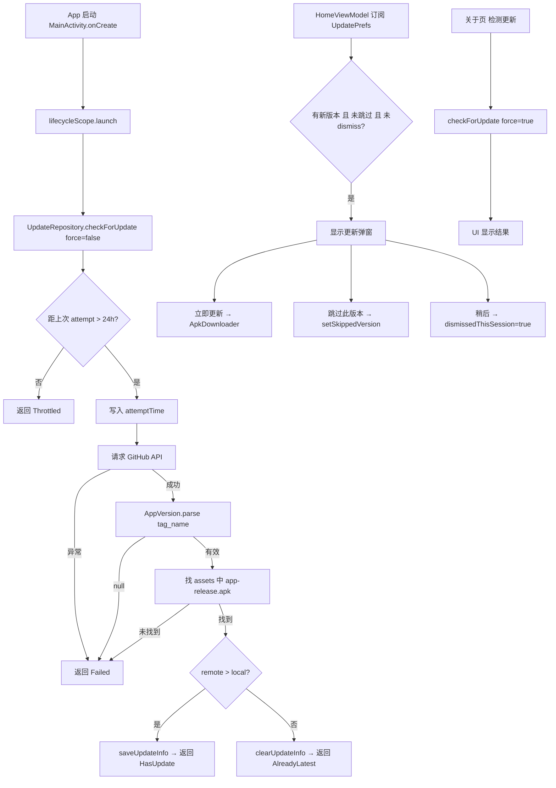

# GitHub OTA 检测更新

## 0. 需求摘要

**用户目标**：轻小信用户能及时发现并安装新版本，无需手动去 GitHub 查看。

**核心行为**：
- App 启动时静默检测（24h 节流），发现新版本在首页弹窗提示
- "我的"页"关于轻小信"行 hint 变为"发现新版本 vX.X.X"
- 关于页提供手动"检测更新"入口，失败有明确反馈
- 用户确认更新后通过系统 DownloadManager 下载 APK 并引导安装

**成功标准**：
- 自动检测失败不影响 App 任何正常功能
- 手动检测失败显示"检测失败，请稍后再试"
- 用户可跳过某版本，后续不再对该版本弹窗
- 下载完成后能正确引导到系统安装界面

**明确不做**：
- 不做应用内增量更新 / 热修复
- 不做后台定时轮询（仅启动时触发）
- 不做下载进度 UI（依赖系统通知栏）
- 不做强制更新逻辑
- 不做 GitHub Token 认证（公开仓库无需）

## 1. 决策与约束

**模块归属**：新建 `feature/update/` 独立模块，按 `data/domain/download` 三包组织。持久化层 `UpdatePrefs` 放 `core/settings/`（与 `DeveloperPrefs` 同级）。

理由：OTA 是独立功能，不属于现有任何 feature 包；与 about/home/profile 的交互通过 DI 注入 Repository/Prefs 完成，不产生包级依赖。

**网络层**：新增 `@UpdateRetrofit` Qualifier 的 Retrofit 实例。OkHttpClient 在 `provideUpdateRetrofit()` 内部私有构建（不暴露为 Hilt provider），避免与默认 `OkHttpClient` 冲突。不复用主站 `AuthInterceptor` / `TokenRefreshInterceptor`。GitHub API 无需认证，超时设短（10s）。

理由：与校内接口完全无关，不应共享认证拦截器；独立超时避免 GitHub 不可达时拖慢其他请求；OkHttp 不暴露为全局 provider 因为只有 UpdateRetrofit 消费它。

**版本号约定**：Release tag 格式 `v1.2.0`（严格三段语义化版本），APK asset 名固定 `app-release.apk`。

**复杂度档位**：走默认档位，无高并发 / 对外 SDK / 一次性工具偏离。

**API 级别分支**：
- `canRequestPackageInstalls()` 仅 API >= 26 调用（本项目 minSdk=26，实际全覆盖）
- 动态注册 receiver 使用 `ContextCompat.registerReceiver(..., RECEIVER_NOT_EXPORTED)`

## 2. 方案

### 2.1 名词层

**现状**：项目无任何更新检测相关类型。版本号由 `build.gradle.kts` 的 `versionName` 定义，关于页和"我的"页各自通过 `PackageManager` 读取（无统一封装）。

**变化**：

```kotlin
// feature/update/domain/AppVersion.kt
data class AppVersion(val major: Int, val minor: Int, val patch: Int) : Comparable<AppVersion> {
    companion object {
        /** 只接受 v?数字.数字.数字，其他返回 null */
        fun parse(tag: String): AppVersion?  // 正则 ^v?(\d+)\.(\d+)\.(\d+)$
    }
    fun toVersionName(): String = "$major.$minor.$patch"
}

// feature/update/domain/AppVersionProvider.kt — 统一本地版本读取
@Singleton
class AppVersionProvider @Inject constructor(@ApplicationContext context: Context) {
    val versionName: String   // PackageManager 读取，失败返回 ""
    val appVersion: AppVersion?  // parse(versionName)
}

// feature/update/domain/UpdateResult.kt
sealed interface UpdateResult {
    data class HasUpdate(val info: UpdateInfo) : UpdateResult
    data object AlreadyLatest : UpdateResult
    data object Throttled : UpdateResult      // 24h 内节流跳过
    data class Failed(val reason: String) : UpdateResult
}

// feature/update/domain/UpdateInfo.kt
data class UpdateInfo(
    val version: AppVersion,
    val versionName: String,    // "1.2.0"，UI 拼 "v" 前缀
    val downloadUrl: String,
    val releaseNotes: String,
)

// feature/update/data/GitHubReleaseDto.kt
data class GitHubReleaseDto(
    @SerializedName("tag_name") val tagName: String,
    val body: String?,
    val assets: List<AssetDto>,
)
data class AssetDto(
    val name: String,
    @SerializedName("browser_download_url") val browserDownloadUrl: String,
)
```

**版本解析边界**：
- `v1.1.0` / `1.1.0` → 有效
- `v1.1` / `v1.1.0-beta` / `""` → null（无效）
- 无效 tag：自动检测静默忽略，手动检测返回 `Failed("无法解析版本号")`

### 2.2 编排层

**现状**：无更新检测流程。MainActivity 启动时只做 `homeBootstrap.load()` 和 shortcut 路由。

**变化**：



**UpdateRepository 核心编排**（注入 `GitHubReleaseApi`、`UpdatePrefs`、`AppVersionProvider`）：

`checkForUpdate(force: Boolean): UpdateResult`
1. 非 force：读 `lastCheckAttemptTime`，不足 24h → `Throttled`
2. 读本地版本 `AppVersionProvider.appVersion` → null 则返回 `Failed("无法解析当前版本号")`
3. 写入 `updateCheckAttemptTime()`（无论后续成功失败）
4. 请求 `GET repos/Relianttt/lightxin/releases/latest`
5. 解析 `tag_name` → `AppVersion.parse()` → null 则 `Failed("无法解析远程版本号")`
6. 从 `assets` 找 `name == "app-release.apk"` → 找不到则 `Failed("未找到安装包")`
7. 比较：remote > local → `saveUpdateInfo()` 返回 `HasUpdate`；否则 `clearUpdateInfo()` 返回 `AlreadyLatest`
8. 任何异常 catch → `Failed(e.message)`

**弹窗显示条件**（HomeViewModel 内存 + DataStore 缓存）：
`latestVersion > localVersion && latestVersion != skippedVersion && !dismissedThisSession`

**下载安装编排**（ApkDownloader）：
1. 检查 `canRequestPackageInstalls()` → 无权限引导到系统设置，Toast 提示，返回 false
2. 删除旧文件（固定路径 `getExternalFilesDir(DIRECTORY_DOWNLOADS)/lightxin-update.apk`）
3. DownloadManager.enqueue → 保存 downloadId 到 UpdatePrefs
4. 动态注册 BroadcastReceiver 监听 `ACTION_DOWNLOAD_COMPLETE`
5. 校验 downloadId 匹配 → 查询 `DownloadManager.Query` 状态：`STATUS_SUCCESSFUL` 则注销 receiver → FileProvider URI → 启动安装 Intent；否则 `clearPendingDownloadId()`

**兜底恢复**：关于页进入时调用 `checkPendingDownload()`，查询 DownloadManager 状态，`STATUS_SUCCESSFUL` 则继续安装引导，失败/不存在则 `clearPendingDownloadId()`。

### 2.3 挂载点清单

删掉以下条目，feature 在用户/系统视角即消失：

| # | 挂载位置 | 作用 |
|---|---|---|
| 1 | MainActivity.onCreate 中 `checkForUpdate(force=false)` 调用 | 自动检测触发点 |
| 2 | HomeScreen 更新弹窗（LxDialog） | 用户感知新版本的主入口 |
| 3 | ProfileScreen "关于轻小信" hint 动态文案 | 用户在"我的"页感知新版本 |
| 4 | AboutScreen "检测更新" 行 | 手动检测入口 |
| 5 | AndroidManifest `REQUEST_INSTALL_PACKAGES` 权限 + FileProvider | 安装 APK 的系统级注册 |

### 2.4 推进策略

按 paradigm 维度切片：

| 步骤 | 维度 | 内容 | 退出信号 |
|---|---|---|---|
| 1 | 领域模型 | AppVersion + AppVersionProvider + UpdateResult + UpdateInfo | 单元测试全部通过（解析/比较） |
| 2 | 持久化 | UpdatePrefs（DataStore） | 读写 Flow 验证通过 |
| 3 | 网络层 | GitHubReleaseApi + Dto + Hilt Module（独立 OkHttp + @UpdateRetrofit） | 编译通过，可手动调用 |
| 4 | 编排核心 | UpdateRepository.checkForUpdate() | 对接真实 API 返回正确 UpdateResult |
| 5 | UI 集成 - 自动检测 | MainActivity 注入 + 调用 | App 启动后 DataStore 有检测结果 |
| 6 | UI 集成 - 首页弹窗 + 我的页 hint | HomeViewModel 订阅 + 弹窗 + ProfileScreen hint 变化 | 有缓存新版本时弹窗显示、hint 变化 |
| 7 | UI 集成 - 关于页手动检测 | AboutViewModel + 检测更新行 UI | 手动检测成功/失败都有反馈 |
| 8 | 下载安装 | ApkDownloader + Manifest 声明 + FileProvider + 兜底恢复 | 点击更新后通知栏下载，完成后弹安装 |

### 2.5 结构健康度与微重构

评估即将改动的文件：

- **MainActivity.kt**（~100 行）：只加一行 `lifecycleScope.launch { updateRepository.checkForUpdate(false) }`，健康。
- **HomeScreen.kt**（~120 行）：加弹窗逻辑。HomeScreen 本身只是 tab 容器，弹窗挂在 Scaffold 外层，不膨胀。
- **ProfileScreen.kt**（~250 行）：只改 hint 参数来源，不加逻辑。
- **AboutScreen.kt**（~190 行）：加一个 LxCard 行 + 检测状态 UI。可接受。
- **AboutViewModel.kt**（~50 行）：加检测更新方法。轻量。

**结论：本次不做微重构。** 所有被改动文件职责清晰、体量合理，新增代码是已有职责的自然延伸。

## 3. 验收契约

### 正常场景

| # | 触发 | 期望结果 |
|---|---|---|
| 1 | App 启动，距上次检测 > 24h，GitHub 有新版本 | DataStore 写入新版本信息；首页弹窗显示"发现新版本 vX.X.X" + 更新日志 |
| 2 | App 启动，距上次检测 < 24h | 不发起网络请求，UI 读取缓存状态 |
| 3 | 首页弹窗点击"立即更新" | 系统通知栏出现下载任务"轻小信更新"，下载完成后弹出系统安装界面 |
| 4 | 首页弹窗点击"跳过此版本" | 弹窗关闭，后续启动不再对该版本弹窗；更高版本仍会弹 |
| 5 | 首页弹窗点击"稍后" | 弹窗关闭，本次启动不再弹；下次启动仍弹（进程重建后重置） |
| 6 | "我的"页有缓存新版本且未跳过 | "关于轻小信"行 hint 显示"发现新版本 v1.2.0"（LxTerra 色） |
| 7 | 关于页点击"检测更新"，有新版本 | 显示"发现新版本 vX.X.X" + "立即更新"按钮 |
| 8 | 关于页点击"检测更新"，已是最新 | 显示"已是最新版本" |
| 9 | App 启动，已是最新版本 | DataStore 清空旧版本信息，首页不弹窗，hint 显示当前版本号 |

### 边界场景

| # | 触发 | 期望结果 |
|---|---|---|
| 10 | Release tag 为 `v1.1.0-beta` 或 `v1.1` | 自动检测静默忽略；手动检测显示"检测失败，请稍后再试" |
| 11 | Release assets 中无 `app-release.apk` | 同上 |
| 12 | 用户跳过 v1.2.0 后，发布 v1.3.0 | v1.3.0 正常弹窗（skipped_version 只记一个版本） |
| 13 | 下载中用户划掉 App，重新打开进入关于页 | 兜底检查 pendingDownloadId，已完成则引导安装 |
| 14 | 未授权"安装未知应用"时点击"立即更新" | 跳转系统设置页，Toast "请授权后重新点击更新" |

### 错误场景

| # | 触发 | 期望结果 |
|---|---|---|
| 15 | 自动检测时网络不可达 / GitHub 返回非 200 | 静默失败，App 正常使用，不弹窗不 Toast |
| 16 | 手动检测时网络不可达 | 显示"检测失败，请稍后再试"，不暴露内部异常信息 |
| 17 | DownloadManager 下载失败 | 兜底检查时 clearPendingDownloadId，不影响 App |

### 明确不做（反向核对）

| # | 不做的事 | 验证方式 |
|---|---|---|
| N1 | 不做后台定时轮询 | 无 WorkManager / AlarmManager / Service 注册 |
| N2 | 不做强制更新 | 弹窗始终可关闭（"稍后"按钮） |
| N3 | 不做应用内下载进度 UI | 无自定义进度条组件 |
| N4 | 不做 GitHub Token 认证 | OkHttpClient 无 Authorization header |

## 4. 相关文档

- `codestable/architecture/about-overview.md` — 关于页现有结构
- `codestable/architecture/network-overview.md` — 网络层多域名架构
- `codestable/architecture/home-overview.md` — 首页容器与 HomeViewModel
- `codestable/architecture/DESIGN.md` — 架构总入口（新增 feature/update 后需更新索引）
