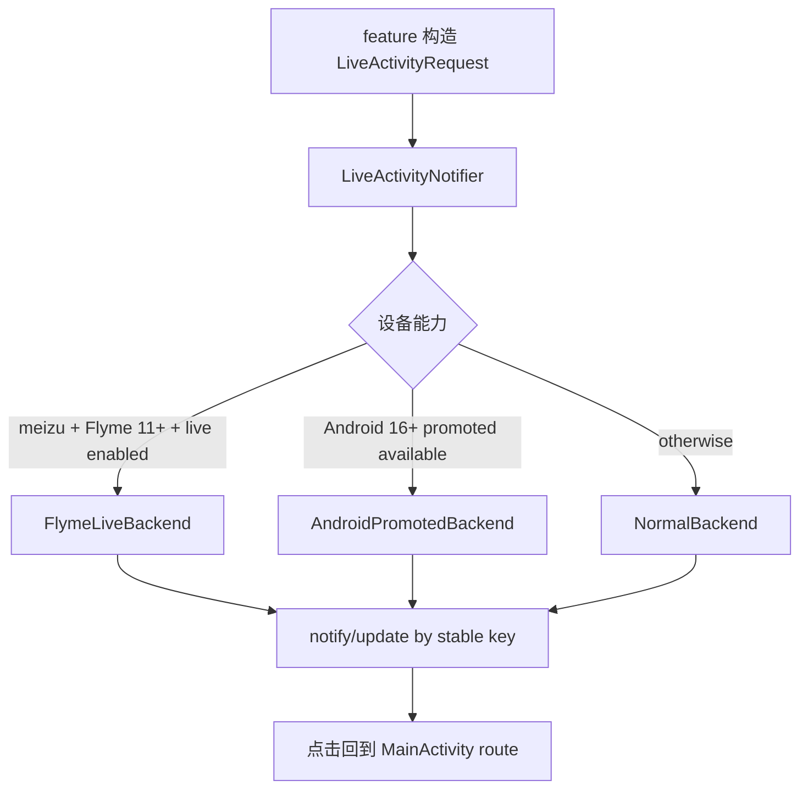

# 全局实况通知抽象

## 0. 术语约定

- **实况通知**：正在进行中的活动状态展示，不等同于推送服务。
- **Flyme 私有实况通知**：Flyme 11+ 上通过 `notification.live.*` extras、`RemoteViews` 和系统实况开关实现的私有胶囊/实况通知。
- **Android 16 原生 Live Updates**：通过 promoted ongoing notification 实现的标准通知形态，不使用 `RemoteViews`。
- **LiveActivityNotifier**：业务 feature 唯一调用入口，负责选择 Flyme / Android16 / Normal backend。

Flyme 和 Android 16 原生不是同一套协议。实现时必须分支隔离，不能用 Android 16 的标准通知限制去约束 Flyme 私有分支，也不能把 Flyme 私有字段混入普通兜底分支。

平台字段契约统一见 `codestable/reference/live-notification-platform-contracts.md`。本文只写 feature 编排，不复制完整平台接口。

## 1. 决策与约束

**需求摘要**

提供一个跨 feature 复用的实况通知入口，首批用于跑步、签到、课程倒计时等“正在进行”的状态。调用方只构造通用请求，不接触 ROM 私有字段。

**成功标准**

- Flyme 11+ 且实况开关可用时，通知能显示为 Flyme 胶囊/实况通知，而不是普通 ongoing 通知。
- Android 16+ 非 Flyme 设备走原生 promoted ongoing notification，不使用自定义通知布局。
- 其他设备稳定回退普通通知，点击仍能回到目标页面。
- 同一业务 key 更新同一条通知，不生成重复通知。

**明确不做**

- 不做 FCM / 服务器推送。
- 不做后台轮询驱动通知。
- 不做 HarmonyOS 实况窗私有适配。
- 不做长期常驻入口型实况通知。
- 不在 feature 层暴露 Flyme extras 或 Android promoted builder。

**关键决策**

1. 对外保留统一 `LiveActivityNotifier` 门面，业务层只传 `LiveActivityRequest`。
2. backend 选择顺序：Flyme 私有 -> Android 16 原生 -> 普通通知。
3. Flyme backend 使用 `codestable/reference/live-notification-platform-contracts.md` 中的 Flyme 私有契约。
4. Android 16 backend 使用同一 reference 中的 Android 原生 Live Updates 契约。
5. 普通 backend 不携带 Flyme 私有字段，也不假装自己是实况通知。

## 2. 名词与编排



### 2.1 名词层

**现状**

- 当前仓库没有可追踪的 `core/notification` 实况通知抽象。
- 跑步前台通知由 `RunTrackingService` 自己构建。
- 被忽略的 `docs/项目规划/实况通知讨论方案.md` 是讨论稿，不是可提交实现契约。

**变化**

新增通用模型：

```kotlin
data class LiveActivityRequest(
    val key: String,
    val channelId: String,
    val title: String,
    val content: String,
    val route: NotificationRoute,
    val ongoing: Boolean = true,
    val policy: LiveActivityPolicy = LiveActivityPolicy.Auto,
    val presentation: LiveActivityPresentation = LiveActivityPresentation.Text,
    val extras: Bundle = Bundle.EMPTY,
)
```

`presentation` 只表达通用内容，不直接表达 `notification.live.*`。ROM 字段只能在 backend 内部生成。

### 2.2 编排层

**现状**

- Flyme 参考实现来自星课表和 Flyme Live Notification Demo。
- 两个参考实现都不是 Android 原生 Live Updates，而是 Flyme 私有协议。

**变化**

编排上只做三件事：

1. 根据设备和权限探测选择 backend。
2. 把通用 `LiveActivityRequest` 映射为对应平台契约。
3. 用稳定业务 key 更新/取消同一条通知。

Flyme 与 Android 16 的具体字段、检测 API、禁用项都引用 `codestable/reference/live-notification-platform-contracts.md`。实现阶段发现协议有变化时先更新 reference，再同步设计或 checklist。

### 2.3 挂载点

- `core/notification/`：统一模型、门面、backend 策略。
- `AndroidManifest.xml`：`POST_NOTIFICATIONS`、`POST_PROMOTED_NOTIFICATIONS`、`flyme.permission.READ_NOTIFICATION_LIVE_STATE`。
- `MainActivity` / navigation：通知点击路由入口。
- `RunTrackingService`：首个消费者，用于验证前台服务通知迁移。
- 后续签到 / 课程倒计时 consumer：验证抽象可复用。

### 2.4 推进策略

1. 建立通用模型和 backend router。
2. 先做 Flyme backend，严格照 reference 的 Flyme 私有契约。
3. 再做 Android 16 backend，严格照 reference 的原生 Live Updates 契约。
4. 做 Normal backend 兜底和点击路由。
5. 迁移跑步前台通知作为首个 consumer。
6. 用 adb dumpsys/logcat + 真机截图验证 Flyme、Android16、Normal 三条路径。

### 2.5 结构健康度与微重构

本次不做微重构。原因：当前重点是把通知协议边界写准，避免把 Flyme 私有协议和 Android 原生协议混在一起；实现时应优先新增 `core/notification` 小文件，而不是改造现有大模块。

## 3. 验收契约

| # | 触发 | 期望结果 |
|---|---|---|
| 1 | Flyme 11+ 且 `isNotificationLiveEnabled=true` 时发布通知 | dumpsys 中出现 `is_live=true`、外层 `notification.live.capsule`，内层完整 `notification.live.capsule*` key，系统显示胶囊/实况通知 |
| 2 | Flyme 分支展开通知 | 使用自定义 `RemoteViews` 显示主通知内容，不再是空白占位卡 |
| 3 | Android 16+ 非 Flyme 发布 ongoing 通知 | 请求 promoted ongoing，不出现 Flyme 私有 extras，不使用 `RemoteViews` |
| 4 | 普通设备发布通知 | 走普通通知兜底，可点击回到目标页面 |
| 5 | 同一 key 连续更新 | 只更新同一条通知，不产生并列重复项 |
| 6 | cancel / finish | 通知可移除，重复调用不报错 |

## 4. 参考证据

- 平台接口契约：`codestable/reference/live-notification-platform-contracts.md`
- 星课表 Flyme 开关检测：`C:/tmp/lightxin-live-notification-research/starSchedule/app/src/main/java/com/star/schedule/notification/NotificationManager.kt`
- 星课表 capsule extras：同文件 `showMeizuLiveNotification`
- Flyme Demo capsule extras：`C:/tmp/lightxin-live-notification-research/Flyme-Live-Notification-Demo/app/src/main/java/org/avium/test/LiveNotificationManager.kt`
- Flyme Demo：`https://github.com/Ruyue-Kinsenka/Flyme-Live-Notification-Demo`
- 星课表：`https://github.com/lightStarrr/starSchedule`
