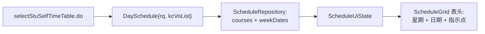

# 课表日期显示

## 0. 术语

- **rq** — 接口 `selectStuSelfTimeTable.do` 响应中 `DaySchedule` 的日期字段，格式 `MM/dd`（如 `05/25`）
- **weekDates** — `Map<Int, String>`，key 为 dayOfWeek（1-7），value 为 `MM/dd` 格式日期。独立于 `Course` 列表

## 1. 决策与约束

**需求摘要**

课表网格当前只显示星期（一～日），用户无法直观对应到具体日期。接口响应中其实已有 `rq` 字段，但未被解析。本次解析后以 `Map<Int, String>` 形式独立传递，在 UI 表头星期下方展示 `MM/dd` 格式日期。

**成功标准**

- 课表网格表头每个星期下方显示对应日期（如 `05/25`）
- 日期数据来源于接口 `DaySchedule.rq`，无需手动输入或本地计算
- 当前周指示点保留，日期夹在星期文字与指示点之间
- 切换周次时日期跟随更新
- 空白天（无课程）也显示日期

**明确不做**

- 不显示年份（格式固定 `MM/dd`）
- 不做学期起始日期手动设置或校历计算
- 不影响首页场景引擎对课表的消费
- 不持久化日期数据

**关键决策**

1. 日期独立于 `Course` 模型——日期是"天的属性"不是"课的属性"，用 `Map<Int, String>` 传递，空天也能显示
2. 数据源来自 `DaySchedule.rq`，不从 `data.rqList` 另开通道（避免两次映射）
3. `weekDates` 随 `ScheduleUiState` 一起传递给 UI

## 2. 编排

### 2.1 名词层

**现状**

```kotlin
// ScheduleResponse.kt
data class DaySchedule(
    val xq: String?,
    val kcVoList: List<CourseVo>?,
    // rq 字段存在但未解析
)

// ScheduleModels.kt
data class Course(
    val name: String,
    val startSection: Int,
    val endSection: Int,
    val room: String,
    val teacher: String,
    val dayOfWeek: Int,
)
// Course 不变
```

**变化**

`DaySchedule` 新增 `rq` 字段。`Course` 不变。新增 `Map<Int, String>` 承载日期数据：

```kotlin
data class DaySchedule(
    val xq: String?,
    val kcVoList: List<CourseVo>?,
    val rq: String?,        // 新增
)
```

`ScheduleUiState` 新增 `weekDates: Map<Int, String>`（可为空 map 兜底）。

```kotlin
data class ScheduleUiState(
    // ... 现有字段
    val weekDates: Map<Int, String> = emptyMap(),  // 新增
)
```

### 2.2 编排层



**现状**

- `ScheduleRepository.getCourses()` 返回 `Result<List<Course>>`
- `ScheduleViewModel` 持有 `ScheduleUiState(courses, ...)`
- `ScheduleGrid` 表头用 `DAY_LABELS` 渲染

**变化**

- `ScheduleRepository.getCourses()` 返回类型改为 `Result<ScheduleData>`，包含 `courses` 和 `weekDates`
- `ScheduleViewModel` 将 `weekDates` 写入 `ScheduleUiState`
- `HomeViewModel.loadTodayCourses()` 和 `HomeBootstrap.loadCourses()` 同步适配新返回类型（只取 `courses`，丢弃 `weekDates`）
- `ScheduleGrid` 接收 `weekDates: Map<Int, String>`，在表头星期下方插入日期

注意：`getCourses()` 除 `ScheduleViewModel` 外还有两处调用——`HomeViewModel` 和 `HomeBootstrap`。返回类型变更时必须同步更新这两处，否则编译失败。

表头渲染顺序（以有课的当前日为例）：
```
    一           （12sp, LxTerra bold）
  05/25          （10sp, LxInkMuted）  ← 新增
    ●            （4dp 圆点, LxTerra）
```

无课日不显示圆点，但日期照常显示。

### 2.3 挂载点

| # | 位置 | 性质 |
|---|---|---|
| 1 | `ScheduleResponse.kt:DaySchedule` | 新增 `rq` 字段 |
| 2 | `ScheduleRepository.kt:getCourses()` | 返回类型扩展为 `ScheduleData`（含 `weekDates`） |
| 3 | `ScheduleViewModel.kt:ScheduleUiState` | 新增 `weekDates` 字段 |
| 4 | `ScheduleScreen.kt:ScheduleGrid()` | 接收 `weekDates` 并渲染日期 |
| 5 | `HomeViewModel.kt:loadTodayCourses()` | 适配新返回类型 |
| 6 | `HomeBootstrap.kt:loadCourses()` | 适配新返回类型 |

### 2.4 推进策略

1. **数据层**：`DaySchedule` 加 `rq` → `ScheduleRepository` 新增 `ScheduleData` 包装类，解析 `weekDates` → 同步更新 `HomeViewModel` 和 `HomeBootstrap` 两处调用 → `ScheduleUiState` 加 `weekDates` 字段
2. **UI 层**：`ScheduleGrid` 接收 `weekDates`，表头渲染日期

每步编译通过即退出。

### 2.5 结构健康度与微重构

本次改动范围小（两字段 + 少量逻辑），涉及文件均健康，不做微重构。

## 3. 验收契约

| # | 触发 | 期望结果 |
|---|---|---|
| 1 | 打开课表，选中当前周 | 表头每天显示 `MM/dd` 格式日期 |
| 2 | 切换到其他周 | 日期跟随变化 |
| 3 | 当天有课 | 星期 + 日期 + 指示点三者同时可见，日期居中 |
| 4 | 当天无课 | 仍显示星期 + 日期，无圆点 |
| 5 | 接口未返回 `rq` | `weekDates` 为空 map，表头格式不变（向后兼容） |

## 4. 参考证据

- 安小信 HAR 抓包：`课表抓包.har` 中 `selectStuSelfTimeTable.do` 响应，确认 `rq` 和 `rqList` 字段存在
- 架构文档：`codestable/architecture/schedule-overview.md`

