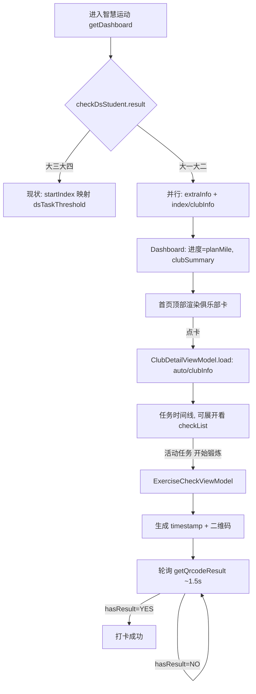

# 大二智慧运动适配 + 锻炼考勤

## 0. 术语约定

| 术语 | 定义 | 防冲突结论 |
|---|---|---|
| 年级分流 | 进入智慧运动后按 `checkDsStudent.do` 返回的 `result`（"大一大二学生" / "大三大四学生"）决定 UI 与数据源 | 代码中无同义概念；`RunningDashboard.studentTypeLabel` 已存该返回值，复用不新增 |
| 俱乐部信息卡 | 大二运动首页今日里程卡上方的入口卡，展示体育课程名/学期/教师/会员级别，点击进俱乐部详情 | 新名词，无冲突 |
| 俱乐部详情 | 单页任务时间线，数据源 `auto/clubInfo.do`；任务节点可展开看记录时长 + 历史打卡，活动任务可发起锻炼考勤 | 与首页 `index/clubInfo.do` 同名异路，详见第 1 节决策 |
| 锻炼考勤 | 大一大二体育课打卡：App 本地生成二维码给固定点位打卡机扫，App 轮询 `getQrcodeResult.do` 等确认 | 原 app 称"锻炼考勤"，沿用 |
| `auto/clubInfo` checkState | 任务活动/结束状态（1=活动可打卡，2=已结束） | ⚠️ 与 `newAutoInfo.do` 的 checkState（签到状态 0/1）同名异义，必须独立 enum，详见第 1 节 |
| ExerciseQrPayload | 锻炼考勤二维码编码的本地 JSON：exerciseId(=autoId)/memberId/checkType/qrCodeType/studentCode/timestamp | 新名词，无冲突 |

## 1. 决策与约束

### 需求摘要

- **做什么**：(1) 智慧运动进入后按年级分流——大三/大四保持现状，大一大二补齐俱乐部信息卡与课外跑步进度；(2) 新增锻炼考勤入口（俱乐部详情页活动任务"开始锻炼" → 本地二维码 + 轮询打卡）与历史记录展示。
- **为谁**：用大二（及大一）账号登录、当前进入智慧运动看不到任何运动数据的学生。
- **成功标准**：
  1. 大二账号进入智慧运动，今日里程卡任务进度显示服务端下发的课外跑步计划（如 11.86/60km），顶部出现俱乐部信息卡。
  2. 大三账号进入智慧运动，所有显示与现状完全一致（无回归）。
  3. 大二点俱乐部卡进详情页，见任务倒序时间线，展开任一任务见历史打卡记录；仅活动任务有"开始锻炼"按钮。
  4. 点"开始锻炼"展示可被外部扫码软件识别的二维码，打卡机扫码后页面轮询到"打卡成功"。
- **明确不做**：
  - 不显示 `venueList` 场馆清单（打卡点位固定，对用户无价值，不解析）。
  - 不展示 `extraScore` 课外得分。
  - 不按性别/年级在客户端计算任务目标（见关键决策 A）。
  - 不改 App 主页（首页）运动卡的 UI 形态与入口行为；但其数据源可随 `getDashboard()` 一并修正大一大二的真实进度（大二现在显示 0 是问题，修正为服务端 `extraInfo` 真实进度是预期）。分流出的俱乐部卡/详情/锻炼考勤入口仅出现在智慧运动内部。
  - 不做组队/跑团（group）相关打卡。

### 复杂度档位

走 Android feature 默认档位，单一偏离：**新增第三方库 `com.google.zxing:core`**（二维码生成），偏离"零新增依赖"默认——理由见关键决策 C。

### 关键决策

- **A. 任务目标只读服务端下发值，禁止本地按性别/年级计算。** 男女生、各年级目标不同，但差异由服务端预计算后通过返回字段下发（大二读 `extraInfo.planMile/completeMile`，大三读 `dsTaskThreshold/totalTaskThreshold`）。`extraDetailInfo.do` 的 `manMaxMile/womenMaxMile/maxDayMile/min-maxSpeed` 仅辅助参考，不作目标来源。换种做法（本地按性别算）会让名词层多出性别→目标的映射逻辑，且学校调目标即失准——故禁止。
- **B. 年级判定唯一以 `checkDsStudent.do` 返回 `result` 为准**，禁止按学号/任何本地规则推断。`grade` 请求参数（`auto/clubInfo` 等需要）直接复用该返回值（HAR 确认请求体 `grade=大一大二学生` 即 checkDsStudent 的 result），不在 `sportsAuthParams()` 里本地推断。
- **C. 二维码生成引入 `com.google.zxing:core`**（仅核心，约 0.5MB，不引入 `zxing-android-embedded`）。与现有 `decision-ml-kit-barcode` **非真冲突**：该 decision 范围是"扫描二维码用 ML Kit 不用 ZXing"，而 ML Kit 不提供生成能力，本 feature 是该 decision 未覆盖的"生成"新场景。acceptance 阶段需提示更新 `decision-ml-kit-barcode` 边界注明"生成走 zxing-core"。
- **D. `auto/clubInfo.do` 与 `index/clubInfo.do` 同名异路且语义不同**：前者（`mobile/auto/`）返回任务时间线列表，后者（`mobile/index/`）返回首页俱乐部摘要。两者各自映射独立模型，不合并。
- **E. `checkState` 同名异义隔离**：`auto/clubInfo` 节点的 checkState（任务活动/结束）必须用独立 enum/mapper，不复用首页 `newAutoInfo` 的 checkState（签到状态）解释。
- **F. 俱乐部详情用独立 `ClubDetailViewModel`**，不膨胀共享的 `RunningViewModel`；锻炼考勤打卡用独立 `ExerciseCheckViewModel`。

### 前置依赖

无（design 阶段未发现需先解决的结构性前置）。

## 2. 名词与编排

### 2.1 名词层

**现状**（`feature/running/domain/RunningModels.kt`、`feature/running/data/RunningApi.kt`、`RunningRepository.kt`）：
- `RunningDashboard` — 跑步首页摘要，字段面向大三/大四（todayKm/completedKm/leftKm/taskTargetKm/singleRunTargetKm/maxKm/dsFlag/studentTypeLabel）。来源：`RunningModels.kt:1-11`。
- `RunningApi` — 5 个接口：startIndex/checkDsStudent/startRunning/getServerTime/uploadRunningRecord。来源：`RunningApi.kt`。
- `getDashboard()` 仅并行调 startIndex + checkDsStudent，目标值取 `dsTaskThreshold` 等大三字段。来源：`RunningRepository.kt:33-72`。
- `sportsAuthParams()` 组装 9 个身份字段，**无 grade**。来源：`RunningRepository.kt:204-225`。

**变化**：
- `RunningDashboard` 新增字段（动机：承载大二分流所需数据，默认值保证大三不受影响）：
  - **不新增布尔字段**。年级字符串判断（`studentTypeLabel.contains("大一大二")`）收敛在 repository/mapper 内部，不外泄到 UI；UI 是否渲染俱乐部卡直接看 `clubSummary != null`。
  - `clubSummary: ClubSummary?`（大二俱乐部摘要，大三为 null）。
- 新增 `ClubSummary`（名词，来自 `index/clubInfo.do`）：`courseName`(clubName) / `term`(schoolYear-semester) / `teacherName`(teacherList[0].name) / `memberLevel`(memberLevelName)。
- 新增 `ClubTask`（名词，来自 `auto/clubInfo.do` 的 rows[]）：`autoId` / `memberId` / `name` / `requiredMinutes`(requiredTime) / `completedMinutes`(completeTime) / `isActive`(由 checkState=="1" 且 now∈[startDate,endDate] 推断) / `startDate` / `endDate` / `checkRecords: List<ClubCheckRecord>`。**不含 venueList**。
- 新增 `ClubCheckRecord`（历史打卡，来自 checkList[]）：`isNormal`(checkState=="1") / `startDate` / `endDate` / `venueName` / `duration`(time)。
- 新增 `ExerciseQrPayload`（纯 Kotlin）：`exerciseId` / `memberId` / `checkType="1"` / `qrCodeType=1` / `studentCode` / `timestamp`，提供 `toJson()`。
- `RunningApi` 新增 4 接口：`index/clubInfo.do`、`extraInfo.do`、`auto/clubInfo.do`、`qrcode/getQrcodeResult.do`（**multipart**）。

**接口示例**：

```
// 来源：mobile/sportApp/checkDsStudent.do（已有）→ 分流键
result="大一大二学生" → 大二分支；result="大三大四学生" → 大三分支

// 来源：mobile/index/extraInfo.do（大二）→ 任务进度
输入：通用认证参数 + grade
输出：data.extraInfo.{planMile:"60.0", completeMile:"11.86", completeRatio:"0.20"}
映射：taskTargetKm=planMile, completedKm=completeMile

// 来源：mobile/auto/clubInfo.do（大二）→ 任务时间线
输入：通用认证参数 + grade
输出：rows[].{autoId, memberId, name, requiredTime, completeTime, checkState, startDate, endDate, checkList[]}
checkList[].{checkState, startDate, endDate, venueName, time}

// 来源：mobile/qrcode/getQrcodeResult.do（multipart）→ 打卡轮询
输入：multipart{studentCode, timestamp}
输出：data.hasResult="NO"（轮询中）| "YES"（成功，result="打卡成功"）
```

### 2.2 编排层

**主流程图**：



**现状**：`getDashboard()` 是线性 pipeline（并行 2 接口 → 组装 dashboard）。`RunningViewModel` 持有全部跑步首页/模拟/结果态。导航 running 主链 4 路由共享挂在 `Routes.HOME` 的 `RunningViewModel`。来源：`RunningViewModel.kt:55-67`、`NavGraph.kt:169-292`。

**变化**：
- `getDashboard()` 升级为**分支**：读 checkDsStudent.result，大二分支额外并行拉 extraInfo + index/clubInfo 并改用 planMile 作目标；大三分支不变。
- 新增独立编排：`ClubDetailViewModel.load()`（线性：auto/clubInfo → 映射任务列表）；`ExerciseCheckViewModel`（状态机：生成 → 轮询中 → 成功/超时）。
- 导航新增 2 路由 `RUNNING_CLUB_DETAIL`、`RUNNING_EXERCISE_CHECK`（后者携带 Uri.encode 的 autoId/memberId）。

**跨层纪律**：
- 错误语义：按接口独立降级，互不牵连——`extraInfo` 失败不抹掉已拿到的 `clubSummary`，`clubInfo` 失败也不影响已拿到的课外跑步进度；任一为 null 判空不崩，且都不阻塞跑步主流程。
- 幂等/会话：锻炼考勤的 timestamp 在页面进入时生成一次，二维码与轮询全程共用同一值（服务端用它匹配打卡会话）。
- 轮询：~1.5s 间隔，超时（如 60s）停止并提示重试；离开页面取消轮询。
- 约束 A/B：目标值只取返回字段；grade 只取 checkDsStudent.result。

### 2.3 挂载点清单

- 路由表：修改既有 `navigation/Routes.kt` + `NavGraph.kt`，其中新增 `RUNNING_CLUB_DETAIL`、`RUNNING_EXERCISE_CHECK` 两个路由项
- 运动首页 UI 注入点：`RunningHomeScreen` 大二分支俱乐部卡（修改）
- 依赖声明：`gradle/libs.versions.toml` + `app/build.gradle.kts` 新增 `zxing-core`（新增）

（俱乐部详情页、锻炼考勤页、新 ViewModel、新 Api 方法、新模型均为内部实现，不计挂载点。）

### 2.4 推进策略

```
1. 文档修正：把 auto/clubInfo + 锻炼考勤打卡分析补入接口分析报告
   退出信号：文档可查到 auto/clubInfo rows/checkList 字段、命名/语义冲突说明
2. 纯逻辑：ExerciseQrPayload(JSON/timestamp 复用) + QrCodeMatrixGenerator(BitMatrix)
   退出信号：JVM 单测覆盖 payload 字段完整 + BitMatrix 非空尺寸
3. 年级感知解析器：年级判定 / extraInfo 解析 / club 摘要解析为纯函数，再接 Retrofit
   退出信号：JVM 单测覆盖大二/大三两套 JSON 分支 + null 判空
4. 首页俱乐部卡 + 入口：大二渲染、大三隐藏，新增详情路由（详情先占位）
   退出信号：大二见卡可跳转，大三无变化
5. 俱乐部详情：ClubDetailViewModel + getClubDetail 解析 auto/clubInfo，可展开时间线 + 历史
   退出信号：单测解析 rows/checkList + 活动任务判定；详情页展开见历史记录
6. 锻炼考勤打卡 + 全链路接通：ExerciseCheckViewModel 生成二维码 + 轮询，端到端跑通
   退出信号：单测轮询状态机；端到端首页卡→详情→开始锻炼→二维码→打卡成功
```

### 2.5 结构健康度与微重构

##### 评估
- `RunningRepository.kt`（~280 行）— 行数中等；职责单一（跑步数据仓库）；本次加 grade 分支 + 3 个 club/extra 解析，改动密度偏高但属同一仓库职责的自然延伸。
- `RunningApi.kt`（~55 行）— 健康，仅追加接口声明。
- `RunningHomeScreen.kt`（~430 行）— 偏长，但本次只在大二分支插入一张卡片，不重构既有结构。
- `RunningModels.kt`（~75 行）— 健康，仅追加数据类。

##### 结论：不做

本次新增逻辑默认放新文件（ClubDetailViewModel / ExerciseCheckViewModel / 新模型文件 / QrCodeMatrixGenerator 各自独立），不往现有胖文件堆叠；`RunningRepository` 的 club/extra 解析虽改动密度偏高，但可用私有 mapper 函数内聚，不触发"只搬不改行为"的微重构收益。`RunningHomeScreen` 的大二卡片以独立 Composable 承载，避免继续撑大主体。

##### 超出范围的观察
- `RunningHomeScreen.kt`（~430 行）若后续大二分流 UI 继续增长，建议走 `cs-refactor` 拆分大三/大二两套 content composable，本 feature 不动。

## 3. 验收契约

### 关键场景清单

正常路径：
1. 大二账号进入智慧运动 → 今日里程卡任务进度显示服务端 `extraInfo.planMile` 作目标（如 11.86/60km），顶部出现俱乐部信息卡（课程名/学期/教师/会员级别）。
2. 大三账号进入智慧运动 → 显示与现状一致：任务进度用 `dsTaskThreshold`，无俱乐部卡。
3. 大二点俱乐部卡 → 进详情页见任务倒序时间线；展开任一任务 → 见记录时长（completeTime/requiredTime）+ 历史打卡记录（时间/地点/时长/正常或异常）。
4. 详情页仅当前活动任务（checkState=="1" 且 now∈[startDate,endDate]）显示"开始锻炼"按钮，过期任务不显示。
5. 点"开始锻炼" → 展示二维码（可被外部扫码软件解析出含 exerciseId/memberId/studentCode 的 JSON）；轮询到 `hasResult=YES` → 显示"打卡成功"。

边界：
6. `index/clubInfo` 与 `extraInfo` 按接口独立降级：其一失败/为 null 不影响另一已成功的数据（extraInfo 失败仍显示俱乐部卡，clubInfo 失败仍显示课外跑步进度），均不崩溃、不阻塞跑步主流程。
7. 锻炼考勤轮询超时（60s 无结果）→ 停止轮询并提示重试；离开页面 → 轮询取消。

错误/反向核对（"明确不做"）：
8. 详情页 UI 与解析中不应出现 `venueList` 场馆清单渲染。
9. 代码中不应出现按性别/学号计算任务目标的分支；目标值只来自接口返回字段。
10. 年级判定只读 `checkDsStudent.result`，代码中不应出现按学号前缀/位数推断年级。
11. App 主页运动卡的 UI 形态与导航入口不变；大一大二账号该卡数据从 0 修正为服务端真实进度（随 `getDashboard()` 升级）。
12. `auto/clubInfo` 的 checkState 解析使用独立 enum，不复用 `newAutoInfo` 的签到状态解释。

## 4. 与项目级架构文档的关系

acceptance 阶段需提炼回架构：
- **名词** → `running-overview.md`：新增 `ClubSummary` / `ClubTask` / `ClubCheckRecord` / `ExerciseQrPayload`，以及 `RunningDashboard` 的年级分流字段，提炼进"数据与状态"节。
- **动词骨架** → `running-overview.md`：`getDashboard()` 年级分支、锻炼考勤二维码+轮询状态机，提炼进"结构与交互"节；并在文末"已知约束"补"目标值只读服务端 / grade 取 checkDsStudent / checkState 同名异义"。
- **网络** → `network-overview.md`：`@SportsRetrofit` 消费者新增 `auto/clubInfo`/`extraInfo`/`index/clubInfo`/`getQrcodeResult`（multipart）；getQrcodeResult 是 multipart 而非 FormBody，注意 AuthInterceptor sports 档为 Header 注入不受影响。
- **决策边界** → 提示更新 `decision-ml-kit-barcode`：注明"扫描用 ML Kit，生成二维码用 zxing-core"，避免后人误判项目禁用 zxing。
- `ARCHITECTURE.md`：running 包能力描述补"年级分流 + 锻炼考勤"。
